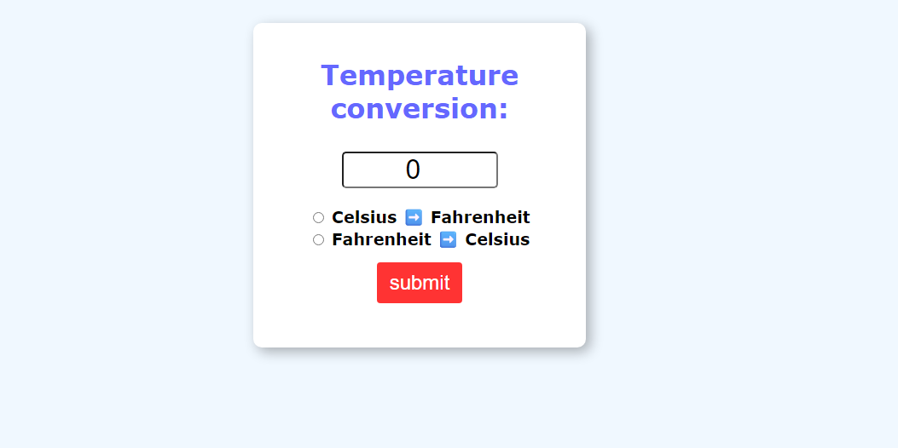

# Temperature Conversion Tool

A simple and efficient web application for converting temperatures between Celsius, Fahrenheit, and Kelvin scales. Built with HTML, CSS, and JavaScript to provide instant temperature conversions with a clean, user-friendly interface.

## 🎯 Project Overview

This temperature converter allows users to quickly convert temperatures between the three most commonly used temperature scales. Perfect for students, professionals, or anyone needing quick temperature conversions.

### Key Features:
- ✅ Convert between Celsius (°C), Fahrenheit (°F), and Kelvin (K)
- ✅ Real-time conversion as you type
- ✅ Input validation and error handling
- ✅ Responsive design for all devices
- ✅ Clean, intuitive user interface
- ✅ Precise calculations with proper rounding

## 🌟 Preview

 <!-- Add your screenshot here -->

**Live Demo**: [View Temperature Converter](https://thalesmar.github.io/Temperature-conversion-/) <!-- Update with actual GitHub Pages URL -->

## ✨ Features

- **Multi-Scale Conversion**: 
  - Celsius to Fahrenheit and Kelvin
  - Fahrenheit to Celsius and Kelvin  
  - Kelvin to Celsius and Fahrenheit
- **Real-time Updates**: Instant conversion as you type
- **Input Validation**: Handles invalid inputs gracefully
- **Responsive Design**: Works seamlessly on desktop, tablet, and mobile
- **Modern UI**: Clean, professional interface with smooth interactions
- **Accurate Calculations**: Precise mathematical conversions
- **Clear Reset**: Easy-to-use clear/reset functionality

## 🛠️ Technologies Used

- **HTML5** - Structure and semantic markup
- **CSS3** - Styling, layout, and responsive design
- **JavaScript (ES6+)** - Conversion logic and DOM manipulation
- **CSS Grid/Flexbox** - Modern layout techniques

## 🧮 Conversion Formulas

The application uses these standard temperature conversion formulas:

**Celsius to Fahrenheit**: `°F = (°C × 9/5) + 32`
**Celsius to Kelvin**: `K = °C + 273.15`
**Fahrenheit to Celsius**: `°C = (°F - 32) × 5/9`
**Fahrenheit to Kelvin**: `K = (°F - 32) × 5/9 + 273.15`
**Kelvin to Celsius**: `°C = K - 273.15`
**Kelvin to Fahrenheit**: `°F = (K - 273.15) × 9/5 + 32`

## 📱 Responsive Design

- **Desktop**: 1024px and above - Full layout with side-by-side conversion
- **Tablet**: 768px - 1023px - Stacked layout with optimized spacing
- **Mobile**: Below 768px - Single column layout for easy thumb navigation

## 🏗️ Project Structure

```
Temperature-conversion-/
├── index.html              # Main HTML file
├── css/
│   ├── style.css          # Main stylesheet
│   └── responsive.css     # Media queries (if separate)
├── js/
│   ├── script.js          # Main JavaScript logic
│   └── converter.js       # Temperature conversion functions
├── images/
│   └── preview.png        # Screenshot for README
├── README.md              # Project documentation
└── LICENSE                # License file
```

## 🚀 Getting Started

### Prerequisites

- A modern web browser (Chrome, Firefox, Safari, Edge)
- Text editor for modifications (VS Code, Sublime Text, etc.)

### Installation

1. **Clone the repository**
   ```bash
   git clone https://github.com/Thalesmar/Temperature-conversion-.git
   ```

2. **Navigate to the project directory**
   ```bash
   cd Temperature-conversion-
   ```

3. **Open in browser**
   ```bash
   # Option 1: Double-click index.html
   # Option 2: Use a local server (recommended)
   python -m http.server 8000
   # or
   npx serve
   ```

4. **View the application**
   - Direct file: Open `index.html` in your browser
   - Local server: Navigate to `http://localhost:8000`

## 🎨 Customization

### Styling
- Modify colors and fonts in `css/style.css`
- Adjust responsive breakpoints as needed
- Add animations or transitions for enhanced UX

### Functionality
- Add more temperature scales (Rankine, Réaumur, etc.)
- Implement temperature history or favorites
- Add unit conversion for other measurements

### UI Enhancements
- Add dark/light theme toggle
- Implement keyboard shortcuts
- Add conversion explanations or formulas display

## 💡 Usage Examples

1. **Basic Conversion**:
   - Enter `100` in Celsius field
   - Instantly see `212°F` and `373.15K`

2. **Scientific Use**:
   - Enter `273.15` in Kelvin field  
   - See `0°C` and `32°F` (freezing point of water)

3. **Weather Applications**:
   - Convert daily temperatures between scales
   - Useful for international weather reports

## 🌐 Browser Support

- ✅ Chrome (latest)
- ✅ Firefox (latest)  
- ✅ Safari (latest)
- ✅ Edge (latest)
- ✅ Internet Explorer 11+ (with minor limitations)

## 🤝 Contributing

1. Fork the repository
2. Create a feature branch (`git checkout -b feature/amazing-feature`)
3. Commit your changes (`git commit -m 'Add amazing feature'`)
4. Push to the branch (`git push origin feature/amazing-feature`)
5. Open a Pull Request

### Ideas for Contributions:
- Add more temperature scales
- Implement unit tests
- Add accessibility improvements
- Create mobile app version
- Add temperature comparison features

## 👤 Author

**Thales**
- GitHub: [@Thalesmar](https://github.com/Thalesmar)
- Portfolio: [Live Projects](https://thalesmar.github.io/freeCodeCamp-Personal-Portfolio/)

## 🙏 Acknowledgments

- Temperature conversion formulas from scientific standards
- Modern web development best practices
- Responsive design principles
- Clean UI/UX design inspiration
- JavaScript calculation precision techniques

## 📊 Project Status

🟢 **Active** - Currently maintained and accepting contributions

## 🔮 Future Enhancements

- [ ] Add more temperature scales (Rankine, Réaumur)
- [ ] Implement conversion history
- [ ] Add scientific notation support
- [ ] Create API for programmatic access
- [ ] Add offline functionality (PWA)
- [ ] Implement voice input/output
- [ ] Add temperature range validations

---

⭐ **Star this repository if you found it helpful for your temperature conversion needs!**

## 📚 Educational Value

This project demonstrates:
- Mathematical calculations in JavaScript
- Real-time DOM manipulation
- Input validation and error handling
- Responsive web design principles
- Clean code organization and structure